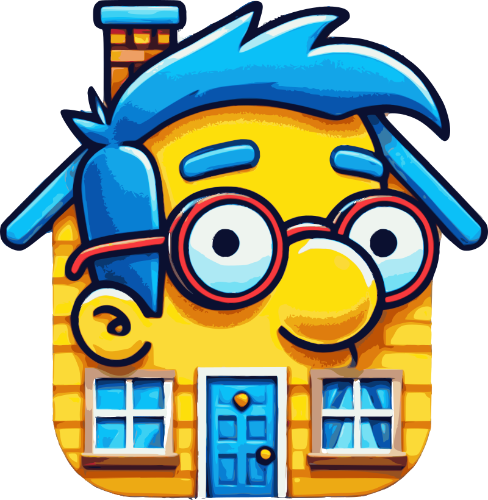

	
	

---

Welcome to MelHouse, a mobile application where you and your housemates can arrange in an easier way all the tasks to be done in the next months, control your common expenses and handle different kinds of events. Our app will allow you to create and edit individual or shared tasks that will bring some rewards if completed. Apart from this, you will be capable of control your expenses and how much each one of you owes to the rest of mates.

## 👨‍💻 Contributors

<table align="center">
    <thead>
        <tr>
            <th>Contributor</th>
            <th>Github</th>
        </tr>
    </thead>
    <tbody>
        <tr>
            <td>García Fernández, Álvaro</td>
            <td></td>
        </tr>
        <tr>
            <td>Lago Conde, Alberto</td>
            <td></td>
        </tr>
        <tr>
            <td>Quintana García, Marco</td>
            <td></td>
        </tr>
    </tbody>
</table>

